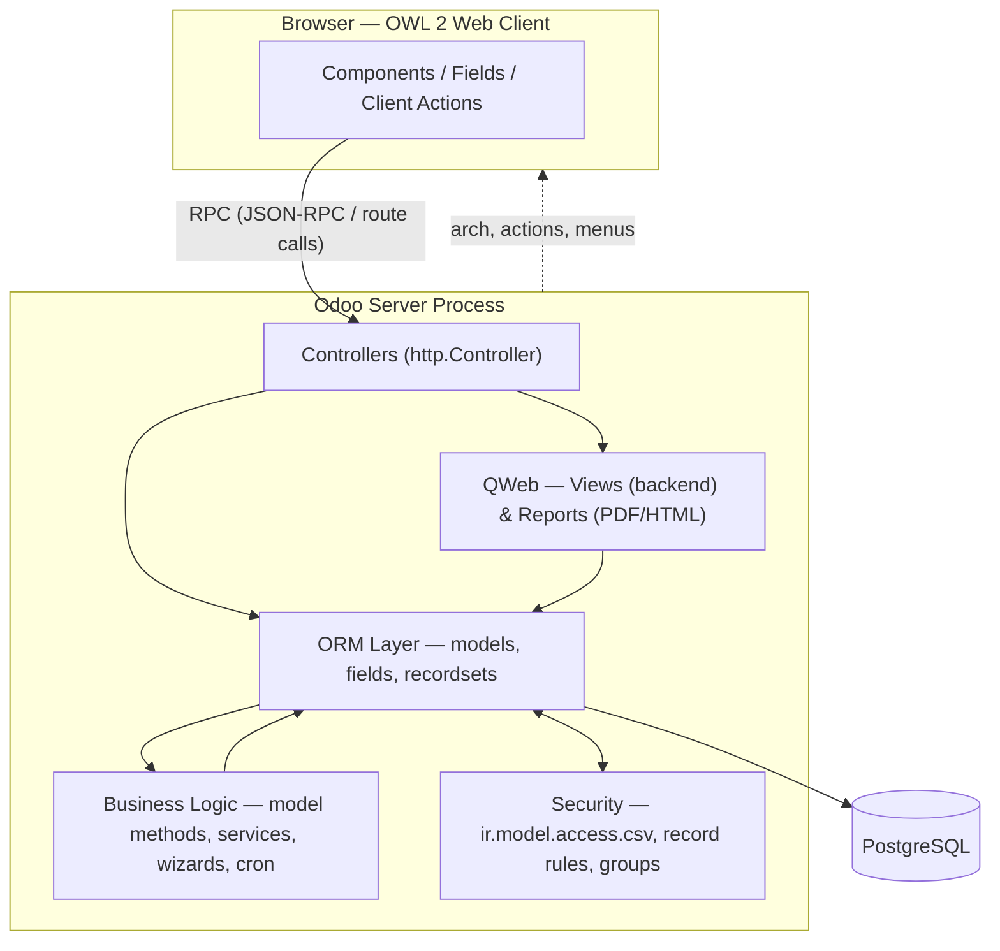

# Odoo 17 Community Development Best Practices Guide

An engineering handbook for professional Odoo developers — not a beginner tutorial. It captures how a senior Odoo technical architect designs, reviews, and upgrades Community-edition modules: standard structure, ORM discipline, security, performance, and upgrade-safety, with the specific behavioral changes that shipped in Odoo 17.

## How to use this handbook

This handbook is split into a router (this file) and 15 topic-specific reference files under `references/`. The router alone is enough for quick decisions (naming, structure, the Golden Rules below). For anything you're about to write more than a few lines of code for, **open the matching reference file(s) before writing the code** — they contain the full Explanation / Best Practice / Why It Matters / Wrong Example / Correct Example / Performance / Security / Odoo-17-notes treatment for every sub-topic, not just a summary.

Rules of engagement when applying this handbook to a task:

1. **Identify the layer(s) touched.** Most real tasks cross layers (e.g., "add an approval flow" touches models, security, views, and maybe a cron). Open every relevant reference file, not just the most obvious one.
2. **Prefer the documented pattern over an improvised one.** If a reference file shows a wrong/correct pair that matches what you're about to write, use the correct pattern verbatim as your starting point.
3. **Never guess at Odoo 17-specific syntax.** The `attrs`/`states` removal, `display_name` compute, and OWL 2 syntax below trip up code generated from older training data or copied from v16 tutorials. Check the [Odoo 17 headline changes](#odoo-17-headline-changes-vs-16) table first.
4. **Run the anti-patterns checklist before calling anything done.** `references/15-anti-patterns-checklist.md` is written as a pre-commit / PR-review pass.
5. **Community edition only.** Don't reach for Studio, Documents, Sign, or other Enterprise-only apps/features as solutions.

## Reference index

| # | File | Covers |
|---|------|--------|
| 1 | `references/01-module-architecture.md` | Standard module layout, `__manifest__.py`, file/folder naming, dependencies, separation of concerns |
| 2 | `references/02-python-models-fields.md` | Models, fields, computed/related/stored fields, constraints, onchange, CRUD overrides |
| 3 | `references/03-python-orm-advanced.md` | Recordsets, `env`, context, domains, prefetching, batch ops, decorators, `_inherit`/`_inherits`, mixins |
| 4 | `references/04-business-logic.md` | Where logic lives, service classes, wizards, server actions, cron jobs, avoiding duplication |
| 5 | `references/05-xml-views.md` | Views, inheritance, XPath, menus, actions, search/form/tree/kanban, notebooks, smart buttons, widgets, decorations |
| 6 | `references/06-security.md` | `ir.model.access.csv`, record rules, groups, multi-company security, common pitfalls |
| 7 | `references/07-owl-javascript.md` | OWL 2 components, registries, services, hooks, patching, client actions, field widgets, asset bundles |
| 8 | `references/08-reports.md` | QWeb reports, report inheritance, performance, printing |
| 9 | `references/09-controllers-api.md` | HTTP/JSON controllers, authentication, request/error handling, API design |
| 10 | `references/10-performance.md` | ORM optimization, N+1 queries, `search()`, `read_group()`/`_read_group()`, batch create/write, caching |
| 11 | `references/11-multi-company.md` | `company_dependent` fields, `with_company()`, `company_id` handling, cross-company safety |
| 12 | `references/12-data-files.md` | XML/CSV data, demo data, `noupdate`, external IDs |
| 13 | `references/13-upgrade-safe-development.md` | Extension vs. modification, stable XML IDs, migration-friendly customization |
| 14 | `references/14-testing.md` | `TransactionCase`, test data, common testing strategies |
| 15 | `references/15-anti-patterns-checklist.md` | Consolidated cross-cutting anti-pattern checklist for code review |

## Module anatomy at a glance

Read top to bottom when deciding where new code belongs: a browser click reaches a controller or an `ir.actions` call, which goes through the ORM (never around it), which is gated by security at every read/write, and business logic lives in the model/service layer — not scattered across views or controllers. `references/04-business-logic.md` covers this placement decision in depth.

## Golden Rules (cheat sheet)

These are the highest-value takeaways across all 15 reference files. If you only have time to skim one section, skim this one — but for anything non-trivial still open the matching reference file for the full reasoning and code.

**Architecture & structure**
- One module = one clear business purpose. Split unrelated features into separate modules with explicit `depends`.
- Never edit another module's files. Extend with `_inherit` (Python) and view inheritance (XML) in your own module.
- Mirror file names to the main model they describe (`sale_order.py` ↔ `sale_order_views.py`), per the [official structure](#reference-index).

**Python / ORM**
- Business logic lives on models (or thin service classes called from models), never in views, and only exceptionally in controllers.
- Every field that can be computed from other stored data should be `compute=`, not written by 10 different `create`/`write` overrides.
- Store a computed field (`store=True`) only if you filter, group, sort on it, or show it in a list — otherwise leave it non-stored.
- Always add `@api.depends` (compute), `@api.constrains` (validation), and `@api.onchange` (UI-only hints) — never mix their responsibilities.
- Loop over recordsets (`for record in self:`), never over `.ids` and re-`browse()`.
- Always call `super()` in overridden CRUD methods and preserve the recordset chain.
- One record: use `self.ensure_one()` at the top of any method that assumes a single record.

**Security**
- Every model exposed to a non-superuser needs a row in `ir.model.access.csv` — no exceptions, including wizards.
- Access rights (CSV) control *model-level* CRUD; record rules control *row-level* visibility. You almost always need both for business models.
- Never call `sudo()` to "make an error go away" without first asking whether the access rights/record rules are actually correct.

**Views**
- Never edit a core/other-module view file. Use `inherit_id` + XPath in your own view record.
- Use stable, semantic XPath (`//field[@name='partner_id']`, not `//field[4]`).
- Odoo 17 removed `attrs`/`states` — use direct `invisible=`, `readonly=`, `required=` Python-expression attributes (see the table below).

**Performance**
- Prefer the ORM (`search`, `search_read`, `read_group`/`_read_group`) over raw SQL; drop to `self.env.cr.execute()` only for aggregation raw SQL genuinely can't express efficiently, and even then keep it parametrized and reviewed.
- Batch `create()`/`write()` over a recordset — never loop calling `create()` once per record.
- Watch for N+1 patterns: accessing a relational field inside a `for record in self:` loop without prefetching triggers one query per record.

**Multi-company & upgrades**
- Never assume `self.env.company` is "the only company" — always consider what happens with 2+ companies active.
- Never hand-edit an XML ID once it has shipped to users; changing it orphans data on upgrade.
- New behavior on an existing screen: add a field/button via inheritance, don't rewrite the base view.

## Odoo 17 headline changes (vs. 16)

Code written against Odoo 16 (or generated by an LLM trained mostly on ≤16 examples) will look plausible but silently break on 17. Check every XML view and every model against this table before treating v16-style code as correct:

| Area | Odoo 16 and earlier | Odoo 17 |
|---|---|---|
| Conditional visibility/readonly/required | `attrs="{'invisible': [('state','=','draft')]}"`, `states="draft"` | Direct attributes: `invisible="state == 'draft'"`, `readonly="..."`, `required="..."` — plain Python-like boolean expressions, no domain tuples needed |
| Hiding a column in a list/tree | `invisible="..."` on the `<field>` hid the whole column | `invisible` on a list-view field now hides only the **cell**; use `column_invisible="..."` to hide the whole column |
| Record display name | Override `name_get()` | Override `_compute_display_name()` and let the `display_name` field (present on every model) do the work; `name_get` is deprecated |
| List/tree view root tag | `<tree>` | Still `<tree>` in 17 (the rename to `<list>` is an **18+** change — don't apply it in 17 code) |
| JS component framework | OWL 1.x, `owl.Component`, `owl.hooks.useState` | OWL 2.x: `import { Component, useState } from "@odoo/owl"`, `setup()` lifecycle, static `props`/`template` |
| Test base class | `TransactionCase` + separate `SavepointCase` | `SavepointCase` is gone; `TransactionCase` itself now gives per-test savepoints with a shared `setUpClass` |

Full detail, rationale, and code for each row lives in the matching reference file (`05-xml-views.md`, `02-python-models-fields.md`, `07-owl-javascript.md`, `14-testing.md`).

## Scope

This handbook targets **Odoo 17.0 Community** only. It does not cover Enterprise-only apps (Studio, Documents, Sign, IoT, Enterprise-only accounting localizations), SaaS-specific tooling, or Odoo.sh operations. Where Community and Enterprise diverge on a topic in scope (e.g., report engine capabilities), the reference files call it out explicitly.
