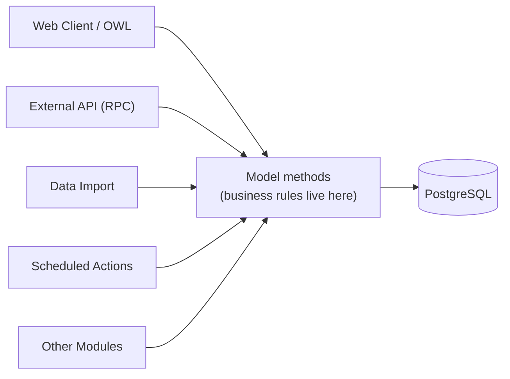

# Business Logic

Governs: where business logic should live, reusable services, wizards, server actions, scheduled actions (cron), avoiding duplicated logic.

---

## 1. Where business logic should live

### Explanation

Odoo gives you at least five places capable of running Python during a user action: model methods, wizards, server actions, controllers, and (for read-only derivations) computed fields. Only one of these — the model layer — is guaranteed to be reached by *every* caller: the web client, the external API (XML-RPC/JSON-RPC), a CSV import, another module's code, and the Odoo shell.



### Best Practice

- **Default location for a business rule: a method on the model it concerns**, or a small service class called from that model method (see §2).
- Controllers, wizards, and server actions should be thin: parse/collect input, call one or more model methods, translate the result back to the caller's format. They orchestrate; they don't decide.
- A rule "must always hold regardless of caller" → belongs in `@api.constrains` or a guarded model method (see `references/02-python-models-fields.md`).
- A rule that's purely about *display convenience* (dynamic visibility, a friendly warning) → belongs in the view or an `@api.onchange` — but never *only* there if the rule also matters for data integrity.

### Why It Matters

Every alternative location is reachable by only a subset of callers. Logic in a controller is invisible to the external API and to cron jobs. Logic in a wizard is invisible to anything that writes to the target model directly. Logic in JS is invisible to literally every non-browser caller. The model layer is the only common funnel — put the rule there and every other layer becomes a thin, safe pass-through.

### ❌ Wrong

```python
# controllers/plant_nursery.py
class PlantNurseryController(http.Controller):
    @http.route('/plant_order/confirm', type='json', auth='user')
    def confirm_order(self, order_id):
        order = request.env['plant.order'].browse(order_id)
        if not order.line_ids:                      # business rule lives ONLY in the controller
            return {'error': "Cannot confirm an empty order"}
        order.state = 'confirmed'
        return {'success': True}
```

Anyone calling `order.write({'state': 'confirmed'})` directly — from the shell, from another module, from a future developer who didn't know about this controller — bypasses the rule entirely.

### ✅ Correct

```python
# models/plant_order.py
class PlantOrder(models.Model):
    _name = 'plant.order'

    def action_confirm(self):
        for order in self:
            if not order.line_ids:
                raise UserError(_("Cannot confirm an order with no lines."))
        self.write({'state': 'confirmed'})
```

```python
# controllers/plant_nursery.py
class PlantNurseryController(http.Controller):
    @http.route('/plant_order/confirm', type='json', auth='user')
    def confirm_order(self, order_id):
        order = request.env['plant.order'].browse(order_id)
        try:
            order.action_confirm()
            return {'success': True}
        except UserError as e:
            return {'error': str(e)}
```

### Security Considerations

This is the same principle as `references/01-module-architecture.md` §6, restated for logic placement specifically: a rule enforced in only one caller-specific layer is a rule that's optional for every other caller. Treat "where is this actually enforced" as a mandatory review question, especially for anything touching money, approvals, or access.

### Odoo 17 Notes

No version-specific change; this is a standing architectural principle independent of Odoo version.

---

## 2. Reusable services

### Explanation

Not every piece of logic is naturally "a method on one model." Cross-model orchestration (e.g., "confirming an order also reserves stock, creates an activity, and notifies a Slack webhook") is often clearer as a small, focused service class than as an ever-growing model method or duplicated logic sprinkled across several models.

```python
# models/plant_order_service.py — plain Python class, not an Odoo model
class PlantOrderFulfillmentService:
    """Coordinates cross-model side effects when an order is confirmed."""

    def __init__(self, env):
        self.env = env

    def fulfill(self, order):
        order.ensure_one()
        self._reserve_stock(order)
        self._notify_nursery_staff(order)
        return True

    def _reserve_stock(self, order):
        for line in order.line_ids:
            line.product_id.with_context(order_ref=order.name)._reserve(line.qty)

    def _notify_nursery_staff(self, order):
        order.activity_schedule(
            'mail.mail_activity_data_todo',
            summary=_("Prepare order %s", order.name),
            user_id=order.nursery_manager_id.id,
        )
```

```python
class PlantOrder(models.Model):
    _name = 'plant.order'

    def action_confirm(self):
        for order in self:
            if not order.line_ids:
                raise UserError(_("Cannot confirm an order with no lines."))
        self.write({'state': 'confirmed'})
        PlantOrderFulfillmentService(self.env).fulfill(self)
```

### Best Practice

- A "service" in Odoo is usually a **plain Python class instantiated with `env`**, not a new Odoo model — it doesn't need a table, ACLs, or views; it needs `env` to call ORM methods.
- Reach for a service class when: the logic coordinates *several* models and doesn't belong more naturally to any single one of them, or the same orchestration is invoked from more than one entry point (a button, a cron, an API endpoint) and you want exactly one implementation.
- Don't create a service class for logic that's naturally single-model — that's just a model method, and wrapping it in a service class adds indirection without benefit.
- Keep services stateless/side-effect-free between calls (construct with `env`, call a method, discard) — don't accumulate state across calls that would make behavior depend on call order.

### Why It Matters

Without an explicit service layer, cross-cutting orchestration tends to accrete onto whichever model happened to have the first button that needed it, and then gets copy-pasted (with drift) onto the next model that needs similar behavior. A service class gives that orchestration a home that isn't arbitrarily tied to one model's lifecycle.

### ❌ Wrong

```python
# Same "confirm and notify staff" logic duplicated (and drifting) across two unrelated models
class PlantOrder(models.Model):
    def action_confirm(self):
        self.state = 'confirmed'
        self.activity_schedule('mail.mail_activity_data_todo', summary="Prepare order")

class PlantSubscriptionOrder(models.Model):
    def action_confirm(self):
        self.state = 'confirmed'
        self.activity_schedule('mail.mail_activity_data_todo', summary="Prep subscription")  # slightly different, copy-pasted
```

### ✅ Correct

Extract the shared orchestration into one service (or a shared mixin if it's purely field/method reuse on models — see `references/03-python-orm-advanced.md` §10) called identically from both models.

### Performance Considerations

A plain Python service class has no ORM registration overhead — it's just an object. Prefer it over an `AbstractModel`-based "service model" pattern unless you specifically need the service to participate in the model registry (rare).

### Odoo 17 Notes

Odoo core itself increasingly uses this pattern (e.g., dedicated non-model helper/service classes in payment-provider integrations) — it's an accepted, idiomatic structure in Odoo 17 code, not an unusual departure from framework norms.

---

## 3. Wizards

### Explanation

A wizard is a `TransientModel` — same field/method API as a normal model, but its table is periodically auto-vacuumed and it's designed for **one interactive step** of user input that then acts on "real" persistent records, not for long-lived business data.

```python
class MakePlantOrder(models.TransientModel):
    _name = 'make.plant.order'
    _description = "Create Plant Order From Template"

    template_id = fields.Many2one('plant.order.template', required=True)
    partner_id = fields.Many2one('res.partner', required=True)

    def action_create_order(self):
        self.ensure_one()
        order = self.env['plant.order'].create({
            'partner_id': self.partner_id.id,
            'line_ids': [
                Command.create({'product_id': line.product_id.id, 'qty': line.qty})
                for line in self.template_id.line_ids
            ],
        })
        return {
            'type': 'ir.actions.act_window',
            'res_model': 'plant.order',
            'res_id': order.id,
            'view_mode': 'form',
        }
```

### Best Practice

- Keep the wizard's own fields limited to *input collection* — the actual business rules (validation, what "confirmed" means, etc.) should still be delegated to the target model's own methods, not re-implemented on the wizard.
- Have the wizard's action method **return an action** (typically opening the newly-created/affected record) rather than leaving the user without navigation feedback.
- Use `default_get`/context (`default_<field>`) to prefill the wizard from the record it was launched from, instead of asking the user to re-enter data already known (e.g., launching "Make Plant Order" from a template record should default `template_id`).
- Don't use a wizard for something that's really just "add a field to the existing form" — that's over-engineering a simple in-place edit into an unnecessary extra step.

### Why It Matters

Wizards exist for genuine multi-field, one-off collection flows (batch invoicing parameters, an import mapping step, a merge confirmation) — not as a default pattern for every user action. Using a wizard where a direct button (`action_confirm` on the record itself) would do adds a click, a screen, and a `TransientModel` to maintain for no benefit.

### ❌ Wrong

```python
# A wizard whose only field is a single boolean confirmation —
# this should just be a confirm dialog or a direct button action
class ConfirmOrderWizard(models.TransientModel):
    _name = 'confirm.order.wizard'
    order_id = fields.Many2one('plant.order')
    are_you_sure = fields.Boolean()

    def action_confirm(self):
        self.order_id.write({'state': 'confirmed'})
```

### ✅ Correct

```python
# Direct action on the model — no wizard needed for a single, unambiguous confirmation
class PlantOrder(models.Model):
    def action_confirm(self):
        for order in self:
            if not order.line_ids:
                raise UserError(_("Cannot confirm an order with no lines."))
        self.write({'state': 'confirmed'})
```

Reserve the wizard pattern for genuinely multi-input flows, like the `MakePlantOrder` example above where a template and a partner must both be chosen before anything can be created.

### Security Considerations

Wizards still need `ir.model.access.csv` entries (see `references/06-security.md`) — "transient" affects garbage collection, not security; a wizard model without an access row is unusable (or, if misconfigured, usable by more roles than intended).

### Odoo 17 Notes

No structural change to `TransientModel` in 17. `Command.create(...)` (imported `from odoo import Command`) is the standard way to build `One2many`/`Many2many` write payloads from a wizard, replacing the legacy `(0, 0, {...})` tuple syntax in new code (both still work, but `Command` is clearer and is what current Odoo core code uses).

---

## 4. Server Actions

### Explanation

A server action (`ir.actions.server`) is a piece of automation configurable **from the UI/data files** (no module code required to trigger it) — bound to a menu item, a button, an automated rule (`base.automation`), or executable ad hoc from a list view's "Actions" menu. Its `state` determines what it does: run Python code, create a record, update field(s), send an email, etc.

### Best Practice

- Use a server action for **admin-configurable** automation — things a functional consultant should be able to wire up or adjust without a code deployment (e.g., "when a lead is marked lost, send this templated email").
- For `state='code'` (raw Python) server actions, keep the code to a few lines that call a real model method — don't write substantial business logic inline in an `ir.actions.server` record; it's much harder to test, review, and version-control meaningfully than a Python method in your module.
- Prefer a proper model method + a thin server action wrapper over a server action containing the entire implementation, for anything that needs unit tests (`references/14-testing.md` can't easily target code embedded in a data record).

### Why It Matters

Server actions are convenient because they're data, not code — but that's exactly their limitation: they don't get code review diffs the same way, aren't natural units for automated tests, and are easy to silently break with an unrelated model refactor since nothing statically checks the Python snippet inside them until it runs.

### ❌ Wrong

```xml
<record id="server_action_notify_low_stock" model="ir.actions.server">
    <field name="name">Notify Low Stock</field>
    <field name="model_id" ref="model_plant_nursery"/>
    <field name="state">code</field>
    <field name="code">
# 40 lines of business logic living only here, untested, unreviewable as a diff
for record in records:
    if record.stock_qty &lt; record.reorder_point:
        # ... extensive logic ...
        pass
    </field>
</record>
```

### ✅ Correct

```python
# models/plant_nursery.py
class PlantNursery(models.Model):
    _inherit = 'plant.nursery'

    def action_notify_if_low_stock(self):
        for record in self:
            if record.stock_qty < record.reorder_point:
                record._send_low_stock_notification()
```

```xml
<record id="server_action_notify_low_stock" model="ir.actions.server">
    <field name="name">Notify Low Stock</field>
    <field name="model_id" ref="model_plant_nursery"/>
    <field name="state">code</field>
    <field name="code">records.action_notify_if_low_stock()</field>
</record>
```

### Odoo 17 Notes

`base.automation` (Automated Actions) — the trigger-plus-server-action combo configurable from Settings — remains the standard Community-edition tool for "when X happens, do Y" without code. It's distinct from Studio's Automation Rules UI, which is Enterprise-only; the underlying `base.automation`/`ir.actions.server` models it configures are Community.

---

## 5. Scheduled Actions (Cron)

### Explanation

An `ir.cron` record runs a model method on a schedule, with no interactive user/session — `self.env.user` inside a cron job is whatever user the cron record specifies (commonly an internal automation/admin user), and there is no "current form" or UI context.

```xml
<record id="ir_cron_archive_old_orders" model="ir.cron">
    <field name="name">Plant Nursery: Archive Old Orders</field>
    <field name="model_id" ref="model_plant_order"/>
    <field name="state">code</field>
    <field name="code">model._cron_archive_old_orders()</field>
    <field name="interval_number">1</field>
    <field name="interval_type">days</field>
    <field name="active">True</field>
</record>
```

```python
class PlantOrder(models.Model):
    _name = 'plant.order'

    def _cron_archive_old_orders(self):
        cutoff = fields.Date.today() - relativedelta(years=2)
        stale_orders = self.search([('state', '=', 'done'), ('date_order', '<', cutoff)])
        stale_orders.write({'active': False})
```

### Best Practice

- Cron-invoked methods should be **batch-oriented by construction** — `search()` for everything relevant, then act on the whole recordset (as above), never processing "the next record" one at a time via repeated cron firings unless you have a specific reason (e.g., rate-limiting external API calls).
- Prefix cron-called methods `_cron_` and keep them private (leading underscore) — they're not meant to be called from a button or the API in the same form.
- Design cron jobs to be **idempotent and safe to re-run** — a cron that partially fails halfway through (timeout, server restart) will run again on its next schedule; make sure that doesn't double-process already-handled records.
- Set a sane `interval_number`/`interval_type`, and consider `numbercall`/`active` for one-off vs. recurring needs — don't schedule sub-minute intervals for anything non-trivial; it will queue up if a run takes longer than the interval.
- Long-running cron logic should batch its own DB commits sensibly for very large datasets (tens of thousands+ of records) to avoid one enormous transaction — but don't over-engineer this for typical data volumes; only add manual `self.env.cr.commit()` batching once you've confirmed you actually need it, since manual commits inside business logic have their own transactional-safety trade-offs.

### Why It Matters

Cron methods are the clearest example of "no UI in front of this" — any assumption baked into a controller or wizard about a logged-in user, a form's current values, or a request context simply doesn't hold here. Code that works when clicked from a button but was never designed for a cron context routinely breaks (missing context defaults, assuming `self.env.user` is a specific person, assuming there's exactly one record to process).

### ❌ Wrong

```python
def _cron_send_reminders(self):
    orders = self.search([('state', '=', 'confirmed')])
    for order in orders:
        self.env['mail.mail'].create({...}).send()   # one create() + one send() per order,
                                                          # each send() a separate SMTP round trip,
                                                          # inside a Python loop
```

### ✅ Correct

```python
def _cron_send_reminders(self):
    orders = self.search([('state', '=', 'confirmed'), ('reminder_sent', '=', False)])
    mail_vals_list = [order._build_reminder_mail_vals() for order in orders]
    mails = self.env['mail.mail'].create(mail_vals_list)   # batch create
    mails.send()                                             # batch send where the mail layer supports it
    orders.write({'reminder_sent': True})                    # mark processed — idempotency guard
```

### Performance Considerations

Cron jobs are exactly where batch operations (§7, `references/03-python-orm-advanced.md`) matter most, because they routinely touch far more records at once than an interactive user action ever would. Always sanity-check a new cron's query plan and expected record count against `references/10-performance.md` before shipping it.

### Odoo 17 Notes

No structural cron API changes in 17. `ir.cron` records loaded via `data/` still need `noupdate` handled correctly (see `references/12-data-files.md`) so that an admin's manual schedule adjustment in production isn't silently reset by a future module update.

---

## 6. Avoiding duplicated logic

### Explanation

Duplication in Odoo modules typically shows up as: the same validation copy-pasted across a model method and an onchange; the same computation reimplemented in a report and a controller; the same "confirm" logic reimplemented on two similar models instead of shared via a mixin or service.

### Best Practice

- **One authoritative implementation, called from everywhere else.** If the same rule needs to run in two contexts (e.g., validating a discount both server-side and giving live UI feedback), the UI-side version calls or mirrors the server method's *logic*, ideally by literally calling it (an onchange can call a regular model method) rather than reimplementing the condition.
- When two models need the same fields/behavior, that's a signal for a mixin (`references/03-python-orm-advanced.md` §10), not copy-paste.
- When the same cross-model orchestration is triggered from more than one place (a button and a cron and an API route), that's a signal for a service or a shared model method (§§1–2 above), not three separate implementations.
- Treat "I'm about to copy this method to another model/file and tweak it slightly" as a hard stop — extract the shared part first.

### Why It Matters

Duplicated business logic doesn't just cost extra code — it's a correctness liability that compounds silently. Two copies of "an order needs at least one line to confirm" will inevitably drift (one gets an extra edge case fixed, the other doesn't), and by the time someone notices, there's already been a period where the same business rule meant two different things depending on which button the user clicked.

### ❌ Wrong

```python
# Same eligibility check duplicated in two methods, already slightly diverged
def action_confirm(self):
    if not self.line_ids or self.amount_total <= 0:
        raise UserError(_("Cannot confirm"))
    self.state = 'confirmed'

def action_auto_confirm_from_cron(self):
    if not self.line_ids:                     # forgot the amount_total check — now the
        self.state = 'confirmed'                 # two paths enforce different rules
```

### ✅ Correct

```python
def _check_can_confirm(self):
    self.ensure_one()
    if not self.line_ids or self.amount_total <= 0:
        raise UserError(_("Cannot confirm an order with no lines or a non-positive total."))

def action_confirm(self):
    for order in self:
        order._check_can_confirm()
    self.write({'state': 'confirmed'})

def action_auto_confirm_from_cron(self):
    eligible = self.filtered(lambda o: not o._check_can_confirm_safe())
    ...
```

### Odoo 17 Notes

Not version-specific — but Odoo 17's push toward computed, `readonly=False` fields over `@api.onchange` (see `references/02-python-models-fields.md` §7) directly reduces one of the most common sources of client/server duplication: a single `compute` method is, by construction, the one place the derivation lives, instead of a parallel onchange implementation that can drift from server-side logic.
