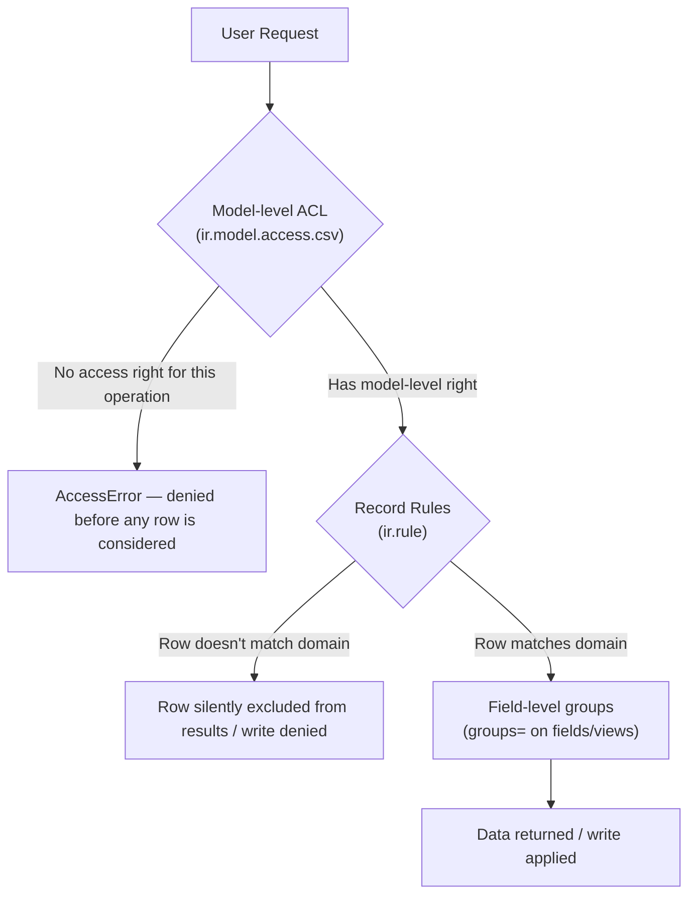

# Security

Governs: `ir.model.access.csv`, record rules, groups, multi-company security, common security pitfalls.

Security in Odoo is layered, and understanding *which layer stops what* is the difference between a module that's actually secure and one that merely looks secure in the UI. Get comfortable with this mental model before writing any access control:



Every layer is necessary; none is sufficient alone. A model with perfect record rules but no `ir.model.access.csv` row is completely inaccessible to non-superusers. A model with a generous ACL but no record rules leaks every row to every user who can read the model at all.

---

## 1. `ir.model.access.csv`

### Explanation

This CSV grants **model-level** CRUD permissions per group (or "all internal users" if no group is specified). It answers: *can this group create/read/write/unlink records of this model at all* — it says nothing about *which* records.

```csv
id,name,model_id:id,group_id:id,perm_read,perm_write,perm_create,perm_unlink
access_plant_order_user,plant.order.user,model_plant_order,plant_nursery.group_nursery_user,1,1,1,0
access_plant_order_manager,plant.order.manager,model_plant_order,plant_nursery.group_nursery_manager,1,1,1,1
access_plant_order_line_user,plant.order.line.user,model_plant_order_line,plant_nursery.group_nursery_user,1,1,1,1
access_make_plant_order_wizard,make.plant.order.wizard,model_make_plant_order,plant_nursery.group_nursery_user,1,1,1,1
```

### Best Practice

- **Every model reachable by a non-superuser needs a row here — no exceptions, including `TransientModel` wizards.** A model with zero matching CSV rows is entirely inaccessible (not "accessible with default permissions") to a non-superuser.
- Grant the minimum CRUD combination a role actually needs. Read-only reference data → `perm_read=1` only. A line model edited only through its parent's form → still needs its own `perm_create`/`perm_write` (children are separate models, not automatically covered by the parent's access rights).
- Use one CSV row per (model, group) pair, named `access_<model_underscored>_<role>` — collisions on `id` are a common copy-paste bug (two rows with the same `id` column silently overwrite each other on load, not merge).
- `model_id:id` references the model's **auto-generated technical XML ID** (`model_<model_name_with_dots_as_underscores>`), not the model's `_name` string directly.
- If **no group is specified** in `group_id:id` (left blank), the rule applies to **every authenticated internal user** — use this deliberately for genuinely shared reference data, not as a default/shortcut to avoid deciding on a group.

### Why It Matters

This is the layer that fails *safe* when misconfigured in one direction (missing row → `AccessError`, loudly, immediately) and fails *unsafe* in the other (row too permissive, or `group_id:id` left blank when it shouldn't be → silent over-exposure that won't throw an error and may not be noticed until an audit or an incident). Because the unsafe failure mode is silent, `ir.model.access.csv` deserves the same review rigor as authentication code in any other stack.

### ❌ Wrong

```csv
id,name,model_id:id,group_id:id,perm_read,perm_write,perm_create,perm_unlink
access_plant_order,plant.order,model_plant_order,,1,1,1,1
```
Blank `group_id:id` with full CRUD (including `unlink`) means **every internal user in the database**, regardless of role, can delete any plant order. This compiles and "works" — nothing errors — which is exactly why it's dangerous.

### ✅ Correct

```csv
id,name,model_id:id,group_id:id,perm_read,perm_write,perm_create,perm_unlink
access_plant_order_user,plant.order.user,model_plant_order,plant_nursery.group_nursery_user,1,1,1,0
access_plant_order_manager,plant.order.manager,model_plant_order,plant_nursery.group_nursery_manager,1,1,1,1
```
Regular users can read/create/edit but not delete; only managers can delete. Row-level *who sees which orders* is then handled by record rules (§2).

### Security Considerations

Treat a blank `group_id:id` column as a decision, not a default — ask explicitly "should literally every internal user in this database have this permission" every time you're tempted to leave it blank for convenience.

### Odoo 17 Notes

No CSV format changes in 17. Remember wizards (`TransientModel`) still need entries — this is frequently forgotten specifically for wizards because they "feel" like UI rather than data, but they're modeled and access-controlled identically to persistent models.

---

## 2. Record Rules

### Explanation

A record rule (`ir.rule`) is a **domain** applied automatically to every `search`/`read`/`write`/`unlink` a matching group's users perform on a model — it answers *which rows*, layered on top of the model-level *whether at all* from §1.

```xml
<record id="plant_order_rule_own_orders" model="ir.rule">
    <field name="name">Plant Order: users see only their own orders</field>
    <field name="model_id" ref="model_plant_order"/>
    <field name="domain_force">[('user_id', '=', user.id)]</field>
    <field name="groups" eval="[(4, ref('plant_nursery.group_nursery_user'))]"/>
</record>

<record id="plant_order_rule_manager_all" model="ir.rule">
    <field name="name">Plant Order: managers see all orders in their companies</field>
    <field name="model_id" ref="model_plant_order"/>
    <field name="domain_force">[('company_id', 'in', company_ids)]</field>
    <field name="groups" eval="[(4, ref('plant_nursery.group_nursery_manager'))]"/>
</record>
```

### Best Practice

- `domain_force` is a domain evaluated with `user` (the current `res.users` record) and `company_ids` (the user's allowed company IDs) available as evaluation variables — use them instead of hardcoding IDs.
- Multiple rules on the **same model** for **different groups** are combined with `OR` — a user in two groups gets the union of what each group's rule allows. Multiple **global** rules (no `groups` set at all) are combined with `AND`. Understand which combination behavior applies before stacking rules, since it's easy to accidentally grant more (OR across groups) or less (AND for global rules) than intended.
- Always set `groups` on rules meant for a specific role — a rule with no `groups` is **global** and applies to everyone, including the model's other rules' groups, ANDed on top of them.
- Record rules apply to **every** access path including `sudo()`-free RPC calls, the Odoo shell, and other modules' code — they do not apply once a call goes through `sudo()` (see §5, pitfalls).
- Write rules to fail toward showing *less* data by default, and grant broader visibility only to roles that have earned it (managers, admins) via an explicit additional rule — not by weakening the base rule.

### Why It Matters

Record rules are what actually make multi-tenant-style visibility ("salespeople see only their own opportunities," "a portal user sees only their own invoices") possible without a single line of Python in the model — but their AND/OR combination semantics are genuinely easy to get backwards, and getting them backwards is a silent data leak, not an error.

### ❌ Wrong

```xml
<!-- Missing <field name="groups">: this rule is GLOBAL, ANDed against every other
     rule on this model for every user, including managers — likely not the intent -->
<record id="plant_order_rule_own_orders" model="ir.rule">
    <field name="name">Users see only their own orders</field>
    <field name="model_id" ref="model_plant_order"/>
    <field name="domain_force">[('user_id', '=', user.id)]</field>
</record>
```

### ✅ Correct

```xml
<record id="plant_order_rule_own_orders" model="ir.rule">
    <field name="name">Plant Order: regular users see only their own orders</field>
    <field name="model_id" ref="model_plant_order"/>
    <field name="domain_force">[('user_id', '=', user.id)]</field>
    <field name="groups" eval="[(4, ref('plant_nursery.group_nursery_user'))]"/>
</record>
```

### Performance Considerations

Record rules are folded into the SQL `WHERE` clause of every query the ORM issues for that model — they're efficient (indexed the same as any other domain clause would be) but every additional rule for the same group adds to that `WHERE` clause's complexity. Keep `domain_force` expressions simple and over indexed columns (`user_id`, `company_id`) rather than deep relational traversals where avoidable.

### Odoo 17 Notes

No rule-engine changes in 17. The `eval="[(4, ref(...))]"` many2many-command syntax for `groups` is standard ORM XML data syntax (see `references/12-data-files.md`), unrelated to the `Command` Python class used in Python code — both express the same "link" concept in their respective contexts.

---

## 3. Groups

### Explanation

`res.groups` records define the roles your access rights and record rules key off. Groups can imply other groups (`implied_ids`) to build role hierarchies (e.g., "Manager" implies "User").

```xml
<record id="group_nursery_user" model="res.groups">
    <field name="name">Nursery User</field>
    <field name="category_id" ref="base.module_category_operations"/>
</record>

<record id="group_nursery_manager" model="res.groups">
    <field name="name">Nursery Manager</field>
    <field name="category_id" ref="base.module_category_operations"/>
    <field name="implied_ids" eval="[(4, ref('group_nursery_user'))]"/>
</record>
```

### Best Practice

- Model groups as a small hierarchy (User → Manager → Administrator) via `implied_ids`, mirroring how core Odoo apps (Sales, Inventory) structure their own access levels — users expect this pattern.
- Give every group a `category_id` so it displays under a sensible heading in Settings → Users → Access Rights, instead of floating uncategorized.
- Don't create a new group for something a broader, existing group (e.g., `base.group_user` for "any internal user") already adequately expresses — group sprawl makes the permission matrix harder to reason about.
- Name groups by role/responsibility (`group_nursery_manager`), not by feature/permission (`group_can_delete_orders`) — the former composes into a coherent access model as the module grows; the latter tends to multiply endlessly.

### Why It Matters

A clean group hierarchy is what makes `ir.model.access.csv` and record rules maintainable as a module grows — if "Manager" automatically implies "User," you write the manager's broader rule once instead of duplicating every user-level right for managers too.

### Odoo 17 Notes

No structural change to `res.groups`/`implied_ids` in 17.

---

## 4. Multi-company security

### Explanation

Multi-company visibility is a **combination** of record rules (usually filtering on `company_id in company_ids`) and correct `company_id` handling in your own model design (see `references/11-multi-company.md` for the full field/`with_company()` treatment). The security-specific concern here is: a record rule that forgets the company dimension entirely leaks data across companies to any user with access to more than one.

### Best Practice

- Any model with a `company_id` field that's meant to be company-scoped needs an explicit record rule filtering on it — Odoo does **not** automatically company-scope every model with a `company_id` field; you opt in with a rule (many core company-dependent models already ship one; your own custom models need their own).
- Standard company-scoping rule shape:

```xml
<record id="plant_order_rule_multi_company" model="ir.rule">
    <field name="name">Plant Order: multi-company rule</field>
    <field name="model_id" ref="model_plant_order"/>
    <field name="domain_force">[('company_id', 'in', company_ids)]</field>
</record>
```

Leave `groups` unset here — this rule should be global (applies to everyone, ANDed with role-specific rules), since "which companies can I see at all" is a different axis from "which role am I."

- For models *without* their own `company_id` but related to a company-scoped parent (e.g., order lines), scope via the parent (`order_id.company_id in company_ids`) rather than duplicating a `company_id` field purely for security filtering, unless you have another reason to denormalize it.

### Why It Matters

A user with access to Company A and Company B, hitting a custom model that has a `company_id` field but no company-scoping record rule, will see **every company's records merged together** in every list, search, and report — a very easy, very common gap in custom modules, precisely because it requires no code to trigger (any two-company user finds it by just using the module normally) and no error is ever raised.

### Odoo 17 Notes

No mechanical change in 17. See `references/11-multi-company.md` for `with_company()`, `company_dependent` fields, and the broader multi-company data model this security layer sits on top of.

---

## 5. Common security pitfalls

### Explanation & Best Practice, paired with concrete anti-patterns

**Pitfall: `sudo()` used to silence an `AccessError` instead of fixing the actual rule.**

```python
# ❌ Wrong — masks whatever the real access problem is, and now this method returns
# cross-user data to every caller regardless of who's actually asking
def get_my_orders(self):
    return self.env['plant.order'].sudo().search([])
```
```python
# ✅ Correct — fix the access rights/record rules so the normal (non-sudo) call works
def get_my_orders(self):
    return self.env['plant.order'].search([('user_id', '=', self.env.uid)])
```

**Pitfall: forgetting that `related`/computed fields still need the *source* model's access respected, but a `sudo()`'d compute silently ignores it.**

```python
# ❌ Wrong — the compute reads sudo()'d data, so a stored version of this field
# leaks the sudo'd value to any user who can merely read this record,
# even if they couldn't read the source model themselves
@api.depends('partner_id')
def _compute_partner_internal_note(self):
    for rec in self:
        rec.partner_internal_note = rec.partner_id.sudo().internal_note
```
```python
# ✅ Correct — don't sudo() a compute unless you specifically intend for the
# computed value to be visible regardless of the viewer's access to the source
@api.depends('partner_id')
def _compute_partner_internal_note(self):
    for rec in self:
        rec.partner_internal_note = rec.partner_id.internal_note   # AccessError if genuinely not allowed —
                                                                       # surface it, don't hide it
```

**Pitfall: exposing a wizard/server action that runs with elevated rights and takes user-controlled input.**

```python
# ❌ Wrong — a wizard button that lets any user with wizard access delete
# arbitrary records by ID, running as sudo
def action_delete_by_id(self):
    self.env['plant.order'].sudo().browse(self.target_id).unlink()
```
```python
# ✅ Correct — let the calling user's own permissions decide whether the delete is allowed
def action_delete_by_id(self):
    self.env['plant.order'].browse(self.target_id).unlink()
```

**Pitfall: relying on `groups=` in a *view* as if it were access control.**

Hiding a field or a menu with `groups=` in XML is a UX affordance — it doesn't stop a user with model-level `ir.model.access.csv` read/write rights from seeing or setting that field via the API, an import, or another view that doesn't hide it. If a field genuinely must not be readable/writable by a role, that has to be enforced at the model layer (a restricted compute, an `AccessError` raised in a guarded `write()` override, or splitting the field onto a separate, access-controlled model) — not just hidden in one view.

**Pitfall: trusting client-supplied IDs/domains in a controller without re-deriving them server-side.**

Covered in depth in `references/09-controllers-api.md` §5 (error/request handling) — the short version: a JSON controller that takes a `company_id` or a list of record IDs directly from the request body and uses it unchecked (instead of deriving allowed scope from `request.env.user`) lets a malicious client widen its own visibility.

### Why It Matters

Every pitfall above shares a pattern: something that *looks* like it enforces security (a `sudo()`'d convenience method, a hidden field, a view-level restriction) that actually only affects the default/happy-path UI, while leaving the real API surface (RPC, other modules, a different view, direct model calls) unguarded. Security review in Odoo should always ask "what happens if this exact operation is attempted through a path that skips the UI."

### Odoo 17 Notes

None of the pitfalls above are Odoo-17-specific — they're standing architectural risks. What *is* 17-specific: because `invisible`/`readonly` conditions are now plain, readable Python expressions directly in the XML (§3 of `references/05-xml-views.md`), it's easier than before to *mistake* a well-written conditional-visibility expression for actual enforcement, precisely because it now reads like real logic. It still isn't — restate the rule as a real server-side guard wherever it matters.
